### Hello there 👋

I'm Aline — software developer and tech educator from Brazil.

- 💻 Software development, backend, databases and software engineering
- 🎓 Teaching computing and software development
- 🌱 Currently studying and building projects around accessibility, mobile and web development

#### Connect with me

#### Main stack

#### GitHub stats

| | |
|:---:|:---:|
|  |  |

